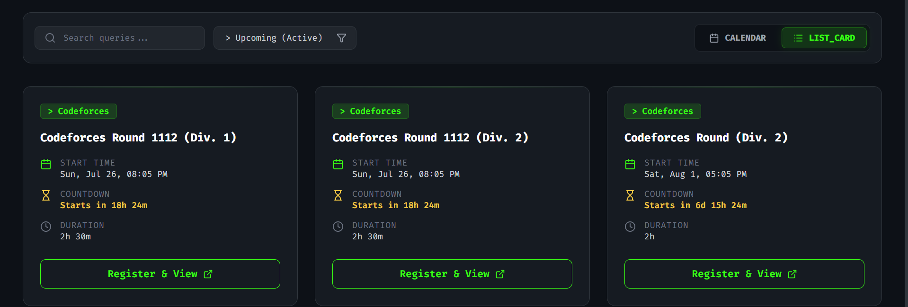
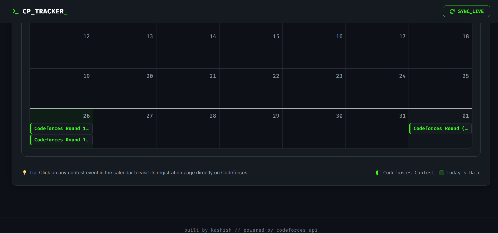

# CP Tracker — Coding Contest Tracker

A full-stack web application that aggregates upcoming competitive programming contests (starting with Codeforces) and displays them in an easy-to-browse calendar and list view — so you never miss a contest again.

## 🔗 Live Demo

Coming soon (deployment in progress)

## 📸 Screenshots

### Card View

### Calendar View

## ✨ Features

- Fetches live contest data from the Codeforces public API
- Automated daily sync using a scheduled cron job to keep data fresh
- Real-time countdown timer showing time remaining until each contest starts
- Dual view modes — Calendar view and List/Card view
- Filter contests by upcoming vs all cached records
- Search contests by name
- Clean, distinct terminal-inspired dark UI

## 🛠️ Tech Stack

**Frontend:** React, Tailwind CSS  
**Backend:** Node.js, Express  
**Database:** MongoDB (Atlas)  
**Other:** node-cron (scheduled tasks), Codeforces Public API

## ⚙️ How It Works

1. A scheduled backend job fetches upcoming contest data from the Codeforces API daily.
2. Contest data (name, start time, duration, platform) is stored in MongoDB.
3. The frontend fetches this data via a REST API and displays it in real time, with live countdown timers calculated from each contest's start time.

## 🚀 Getting Started

### Prerequisites

- Node.js installed
- MongoDB Atlas account (or local MongoDB)

### Installation

\`\`\`bash
git clone https://github.com/yourusername/contest-tracker.git

cd backend
npm install

cd ../frontend
npm install
\`\`\`

### Environment Variables

Create a `.env` file in the `backend` folder:
\`\`\`
PORT=5000
MONGODB_URI=your_mongodb_connection_string
\`\`\`

### Running Locally

\`\`\`bash
cd backend
npm run dev

cd frontend
npm run dev
\`\`\`

## 📌 Future Enhancements

- Add support for more platforms (LeetCode, CodeChef)
- Push notifications for upcoming contests
- User authentication to save favorite/bookmarked contests

## 👤 Author

Built by Kashish Goel
